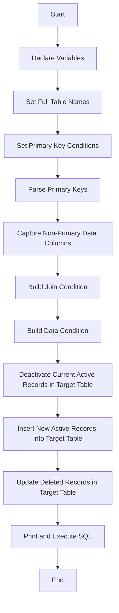

```mermaid
graph TD
    A[Start] --> B[Declare Variables]
    B --> C[Set Full Table Names]
    C --> D[Set Primary Key Conditions]
    D --> E[Parse Primary Keys]
    E --> F[Capture Non-Primary Data Columns]
    F --> G[Build Join Condition]
    G --> H[Build Data Condition]
    H --> I[Deactivate Current Active Records in Target Table]
    I --> J[Insert New Active Records into Target Table]
    J --> K[Update Deleted Records in Target Table]
    K --> L[Print and Execute SQL]
    L --> M[End]

```
